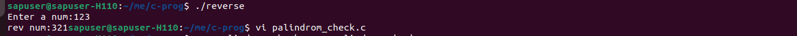

# Basic-Programs
Program-set for concept building
# 📘 C Logic Programs – Core C & Problem Solving

This repository contains **50 C logic programs** covering fundamentals of C programming, problem solving, memory concepts, recursion, bitwise operations, data structures, and mini design-based programs.

The purpose of this repository is to:
- Strengthen **core C fundamentals**
- Build **logic and problem-solving ability**
- Prepare for **embedded systems & product company interviews**
- Serve as a **revision and practice hub**

---

## 🧠 Basics (1–10)

1. Print even and odd numbers between 1–100
   
3. Reverse a number
    
5. Palindrome number check  
6. Armstrong number  
7. Fibonacci series  
8. Factorial (iterative & recursive)  
9. Prime number check  
10. GCD and LCM  
11. Count digits in a number  
12. Sum of digits  

---

## 📦 Arrays & Strings (11–20)

11. Find largest and smallest in array  
12. Reverse an array  
13. Second largest element  
14. Remove duplicates from array  
15. String length without `strlen()`  
16. String palindrome  
17. Count vowels and consonants  
18. Anagram check  
19. Frequency of characters  
20. Substring search  

---

## 🧩 Pointers & Memory (21–30)

21. Swap numbers using pointers  
22. Dynamic memory allocation example  
23. Implement `strlen()`  
24. Implement `strcpy()`  
25. Pointer to array example  
26. Array of pointers  
27. Structure using pointer  
28. Union example  
29. Memory leak demo + fix  
30. Dangling pointer demo  

---

## 🔁 Recursion & Bitwise (31–40)

31. Tower of Hanoi  
32. Binary to decimal  
33. Set, clear, toggle bit  
34. Count set bits  
35. Check power of 2  
36. Swap using XOR  
37. Reverse string using recursion  
38. Matrix addition  
39. Matrix multiplication  
40. Transpose of matrix  

---

## 🗂 Files, Structures & Design (41–50)

41. Student record system  
42. Read/write from file  
43. Menu-driven program  
44. Implement stack using array  
45. Implement queue  
46. Implement circular queue  
47. Implement linked list  
48. Sorting (bubble, selection, quick)  
49. Searching (binary, linear)  
50. Mini project: Library management system  

---

## 🛠️ How to Use This Repository

- Each program is written in **pure C**
- Code focuses on:
  - Logic clarity  
  - Memory safety  
  - Interview-oriented style  
- You can compile using:

```bash
gcc filename.c -o output
./output
```

---

## 🎯 Learning Outcomes

By completing this repository, you will gain strong understanding of:

- Core C syntax & logic  
- Arrays, strings, and pointers  
- Recursion and bitwise operations  
- Basic data structures  
- File handling  
- Mini system-level programs  

---

## 🚀 Future Scope

- Add time/space complexity notes  
- Add optimized versions  
- Convert some programs into **embedded-style implementations**  
- Integrate with microcontroller projects  

---

## 👩‍💻 Author

**Prajaktaa Deokar**  
Embedded Systems | C Programming | Problem Solving  
