# Basic-Programs
Program-set for concept building
# 📘 C Logic Programs – Core C & Problem Solving

This repository contains **50 C logic programs** covering fundamentals of C programming, problem solving, memory concepts, recursion, bitwise operations, data structures, and mini design-based programs.

The purpose of this repository is to:
- Strengthen **core C fundamentals**
- Build **logic and problem-solving ability**
- Prepare for **embedded systems & product company interviews**
- Serve as a **revision and practice hub**

---

## 🧠 Basics (1–10)

1. Print even and odd numbers between 1–100
   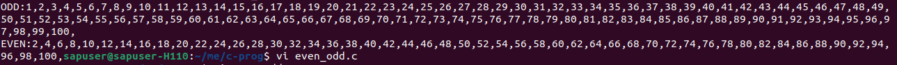
2. Reverse a number
    
3. Palindrome number check
   
4. Armstrong number
   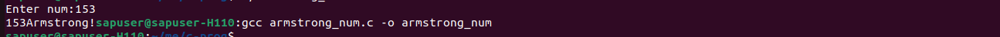
5. Fibonacci series
   
6. Factorial (iterative & recursive)
   
7. Prime number check
   
8. GCD and LCM
     
9. Count digits in a number
   
10. Sum of digits
   
   
---

## 📦 Arrays & Strings (11–20)

11. Find largest and smallest in array
     
12. Reverse an array
    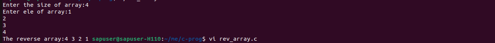 
13. Second largest element
     
14. Remove duplicates from array
    
15. String length without `strlen()`
    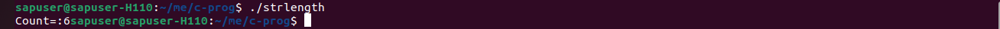
16. String palindrome
    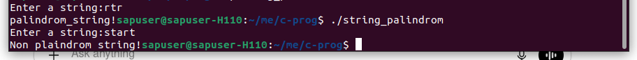
17. Count vowels and consonants
    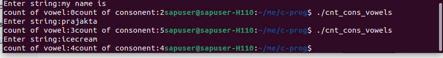
18. Anagram check
    
19. Frequency of characters
     
20. Substring search
    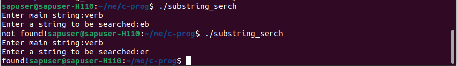

---

## 🧩 Pointers & Memory (21–30)

21. Swap numbers using pointers
    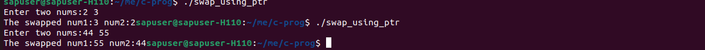
23. Dynamic memory allocation example
    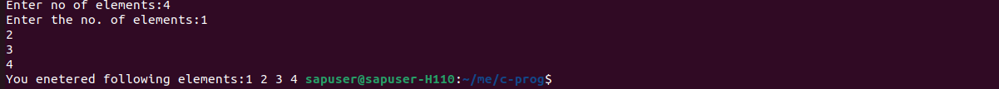
25. Implement `strlen()`
    
27. Implement `strcpy()`  
28. Pointer to array example  
29. Array of pointers  
30. Structure using pointer  
31. Union example  
32. Memory leak demo + fix  
33. Dangling pointer demo
       

---

## 🔁 Recursion & Bitwise (31–40)

31. Tower of Hanoi  
32. Binary to decimal  
33. Set, clear, toggle bit  
34. Count set bits
     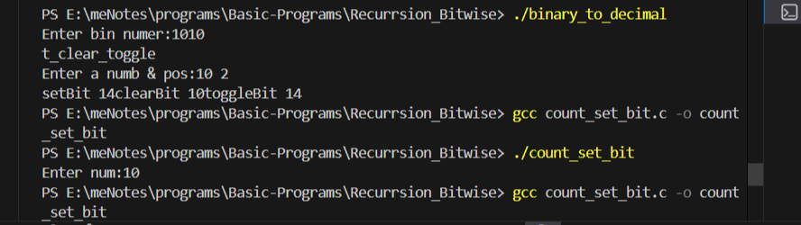   
36. Check power of 2  
37. Swap using XOR  
38. Reverse string using recursion  
39. Matrix addition
    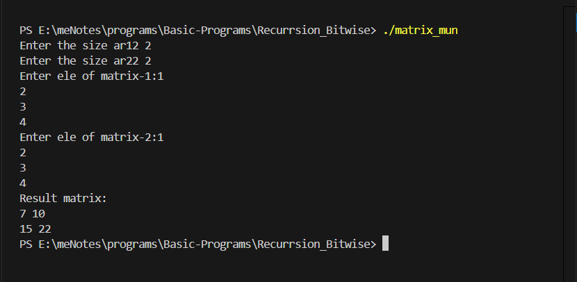
40. Matrix multiplication
   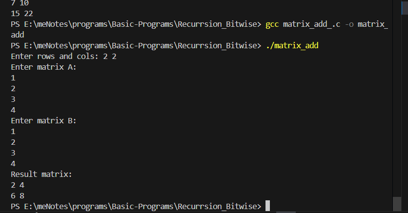 
42. Transpose of matrix  

---

## 🗂 Files, Structures & Design (41–50)

41. Student record system  
42. Read/write from file  
43. Menu-driven program  
44. Implement stack using array
      
46. Implement queue
48. Implement circular queue
50. Implement linked list  
51. Sorting (bubble, selection, quick)  
52. Searching (binary, linear)  
53. Mini project: Library management system  

---

## 🛠️ How to Use This Repository

- Each program is written in **pure C**
- Code focuses on:
  - Logic clarity  
  - Memory safety  
  - Interview-oriented style  
- You can compile using:

```bash
gcc filename.c -o output
./output
```

---

## 🎯 Learning Outcomes

By completing this repository, you will gain strong understanding of:

- Core C syntax & logic  
- Arrays, strings, and pointers  
- Recursion and bitwise operations  
- Basic data structures  
- File handling  
- Mini system-level programs  

---

## 🚀 Future Scope

- Add time/space complexity notes  
- Add optimized versions  
- Convert some programs into **embedded-style implementations**  
- Integrate with microcontroller projects  

---

## 👩‍💻 Author

**Prajaktaa Deokar**  
Embedded Systems | C Programming | Problem Solving  
